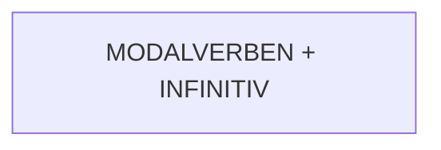

---
tags:
  - grammatik/modalverbs
---

| chtít - wollen | moct - können (dürfen) | umět - können (fähig) | muset - müssen | smět - dürfen |
| --- | --- | --- | --- | --- | 
| chci | můžu | umím | musím | smím | 
| chceš | můžeš | umíš | musíš | smíš | 
| chce | může | umí | musí | smí | 
| chceme | můžeme | umíme | musíme | smíme | 
| chcete | můžete | umíte | musíte | smíte | 
| chtějí | můžou | umí, umějí | musí, musejí | smějí | 

Dann gibt es noch **SOLLEN** = wie haben (mít). (siehe Beispiele)

#### Beispiele
| n | c |
| --- | --- |
| Morgen ist Samstag, ich muss nicht früh aufstehen. |Zítra je sobota, **nemusím** brzy **vstávat**. |
| Ich darf nicht süss essen, ich will nicht dick werden. |**Nesmím jíst** sladké, **nechci být** tlustá |
| Kann ich Tschechisch lernen? (bin ich fähig) |Můžu se učit česky? |
| Soll ich Tschechisch lernen? | Mám se učit česky? |
| Soll ich gehen? | Mám jít? |
| Kannst du Englisch? | Umíš anglicky? |
| Ich soll den ganzen Tag dort sein. | Mám tam  být celý den | 