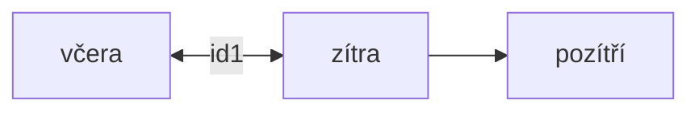
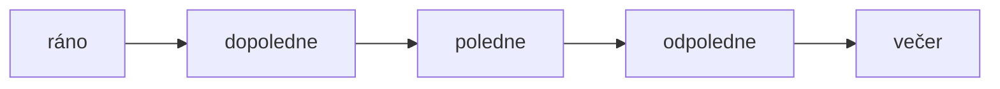

---
tags:
  - weekdays
---
Bei Wochentagen auf die Frage **WANN = KDY** kommt [[Akkusativ]]!

Auf Zeitangaben **VON - BIS = OD - DO** kommt [[Genitiv]]!

| **týden**   | **Woche**  | **Kdy?**      | **od... / do ...** |
| ----------- | ---------- | ------------- | ------------------ |
| pondělí (n) | Montag     | v pondělí     | od/do pondělí      |
| úterý (n)   | Dienstag   | v úterý       | od/do úterý        |
| středa (f)  | Mittwoch   | ve střed**u** | od/do střed**y**   |
| čtvrtek (m) | Donnerstag | ve čtvrtek    | od/do čvrt**ka**   |
| pátek (m)   | Freitag    | v pátek       | od/do pátek        |
| sobota (f)  | Samstag    | v sobot**u**  | od/do sobot**y**   |
| neděle (f)  | Sonntag    | v neděli      | od/do neděle       |

### gestern, heute, morgen, übermorgen

| německý | český     | **Kdy?** |
| ------- | ---------- | --- |
| gestern      | včera             | včera | 
| heute        | dnes / ugs. dneska| dneska |
| morgen       | zítra             | zítra |
| übermorgen | | pozítří           | pozítří |
| früh (Morgen)| ráno              | ráno |
| Vormittag    | dopoledne         | dopoledne |
| Mittag       | poledne           | **v** poledne |
| Nachmittag   | odpoledne         | odpoledne |
| Abend        | večer             | večer |
| Nacht        | noc               | **v noci** |
| Wochenende   | víkend            | **o vikendu** |

### Morgen, Vormittag, ...

