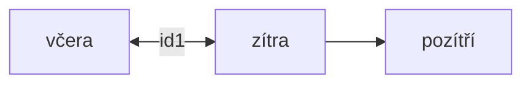
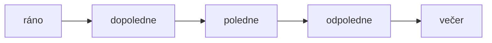

| český   | německý    |
| ------- | ---------- |
| pondělí | Montag     |
| úterý   | Dienstag   |
| středa  | Mittwoch   |
| čtvrtek | Donnerstag |
| pátek   | Freitag    |
| sobota  | Samstag    |
| neděle  | Sonntag    |

### gestern, heute, morgen, übermorgen

### Morgen, Vormittag, ...

