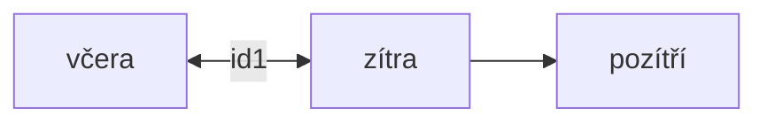
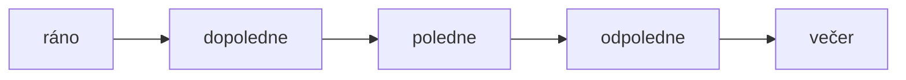

---
tags:
  - weekdays
---
Bei Wochentagen auf die Frage **WANN = KDY** kommt [[Akkusativ]]!

| **týden**   | **Woche**    | **Kdy?** |
| ------- | ---------- | --- |
| pondělí | Montag     | v pndělí |
| úterý   | Dienstag   | v úterý |
| středa  | Mittwoch   | ve střed**u** |
| čtvrtek | Donnerstag | ve čtvrtek |
| pátek   | Freitag    | v pátek |
| sobota  | Samstag    | v sobot**u** |
| neděle  | Sonntag    | v neděli |

### gestern, heute, morgen, übermorgen

| německý | český     | **Kdy?** |
| ------- | ---------- | --- |
| gestern      | včera             | včera | 
| heute        | dnes / ugs. dneska| dneska |
| morgen       | zítra             | zítra |
| übermorgen | | pozítří           | pozítří |
| früh (Morgen)| ráno              | ráno |
| Vormittag    | dopoledne         | dopoledne |
| Mittag       | poledne           | **v** poledne |
| Nachmittag   | odpoledne         | odpoledne |
| Abend        | večer             | večer |
| Nacht        | noc               | **v noci** |
| Wochenende   | víkend            | **o vikendu** |

### Morgen, Vormittag, ...

